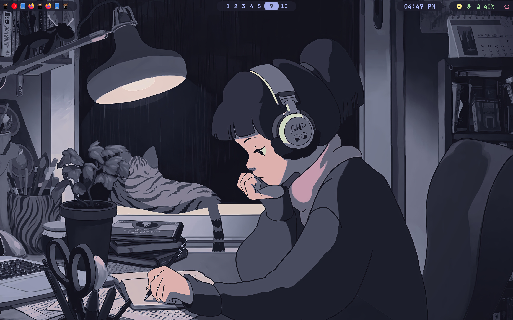
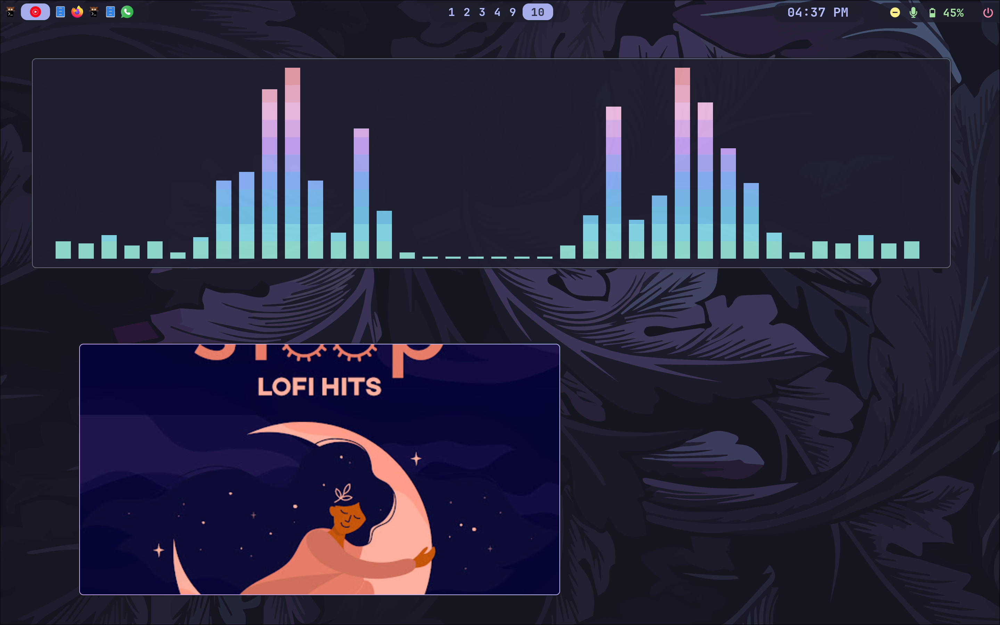
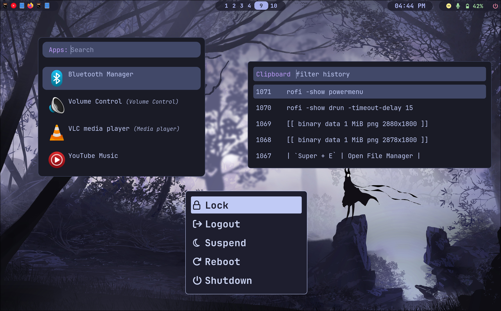
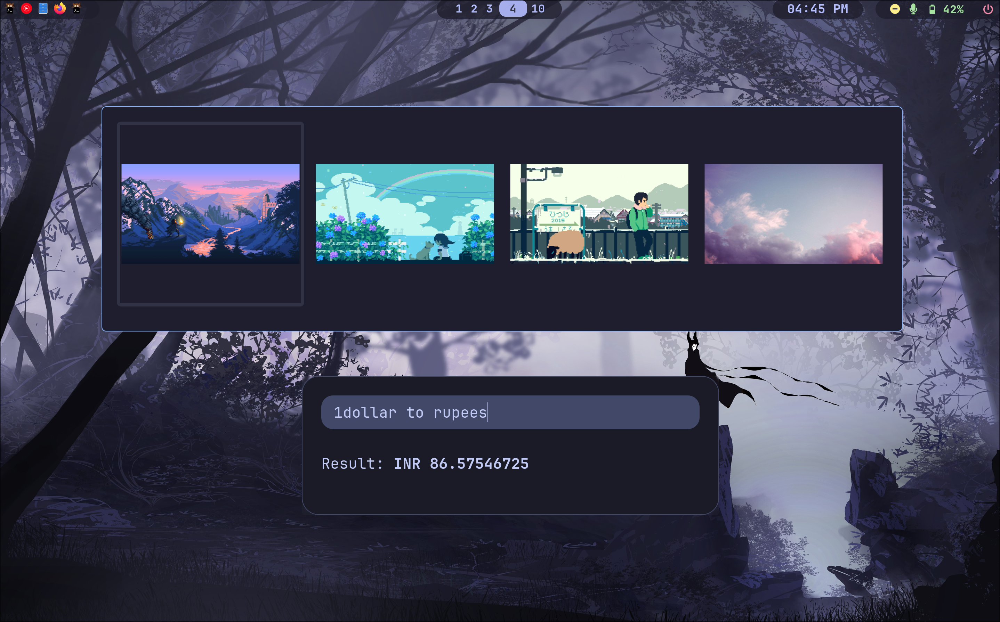
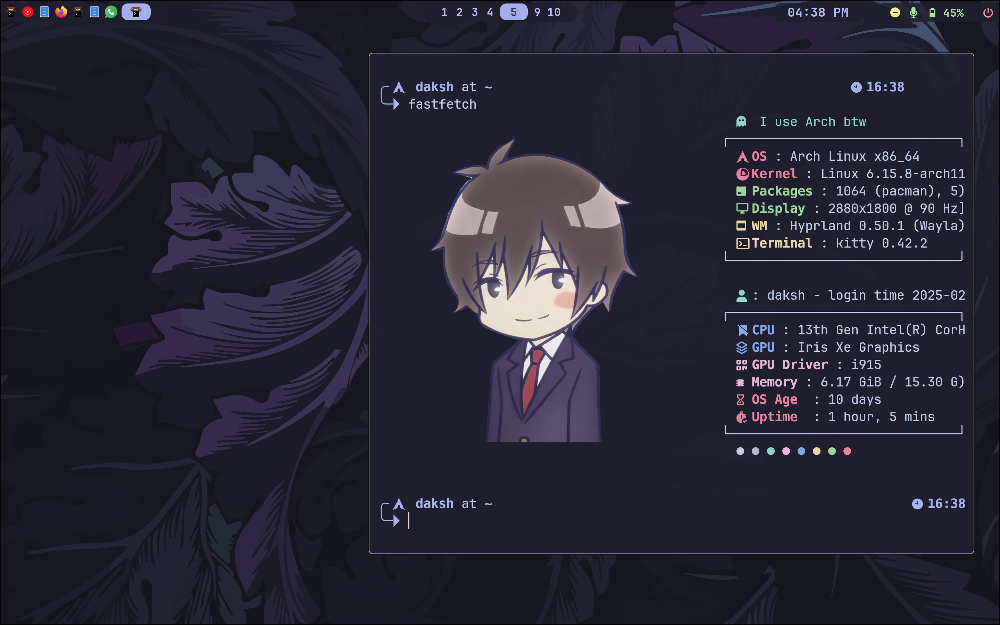
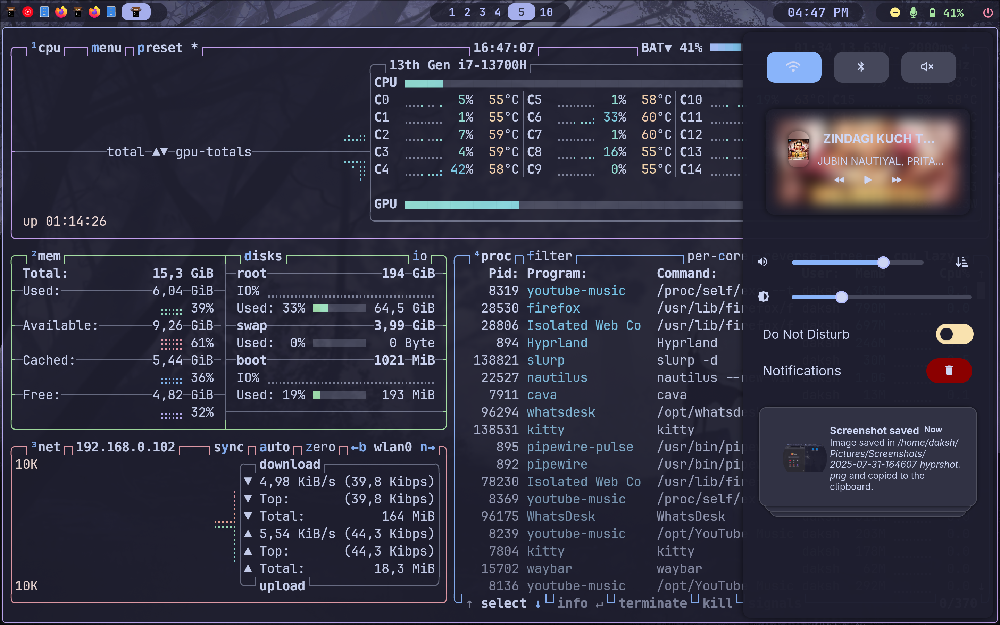

# Hyprland Rice 🍚

My personal dotfiles for a minimal and productive Arch Linux setup running on Wayland.

--------------------------------------------------------------------------------------------------

* **Home**
  

* **Cava and Yt-music**
  

* **Rofi-Menus**
  
  

* **Terminal**
  

* **btop and swyanc**
  

--------------------------------------------------------------------------------------------------

## About The Setup

This setup is built around a dark, clean aesthetic with a focus on keyboard-driven workflow. The main components are:

* **OS**: Arch Linux
* **Window Manager**: Hyprland
* **Bar**: Waybar
* **Launcher**: Rofi
* **Terminal**: Kitty
* **Shell**: bash
* **Theme**: Catppuccin
* **Notification-Control**: Swaync

---

## Keybindings

A list of my most used custom keyboard shortcuts. (Super = windows/cmd key)

| Keybinding          | Action                        |
| ------------------- | ----------------------------- |
| `Super + Enter`     | Open Terminal (Kitty)         |
| `Super + D`         | Application Launcher (Rofi)   |
| `Super + Q`         | Close Active Window           |
| `Super + E`         | Open File Manager             |
| `Super + F`         | Open Web Browser (Firefox)    |

---
## Credits & Acknowledgements

This setup wouldn't be possible without the work of these amazing creators and projects. My configuration is a blend of their ideas and my own customizations.

* **DIMFLIX:** For the original scripts for managing brightness, volume, and system updates.
* **Meowrch:** For inspiration and ideas related to ricing along with many original scripts. `[Link](This is an external link to https://github.com/meowrch/meowrch)`
* **Keyitdev:** For the beautiful `sddm-astronaut-theme`. `[Link](This is an external link to https://github.com/Keyitdev/sddm-astronaut-theme)`
* **ViegPhunt** For such great open-source dotfiles `[Link](This is an external link to https://github.com/ViegPhunt/Dotfiles)`
* And other amazing developers in the open-source community whose work has been an inspiration.
